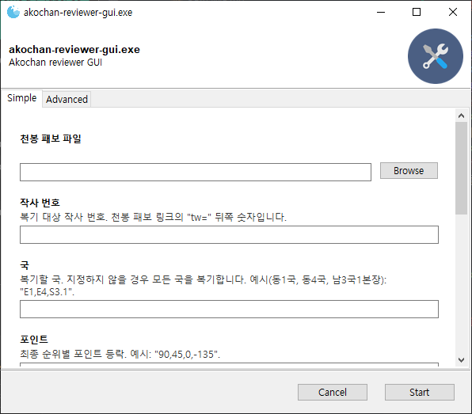

Akochan reviewer GUI
========================

Simple GUI for [Akochan reviewer](https://github.com/Equim-chan/akochan-reviewer)

### 설치 및 사용

1. [Akochan reviewer GUI 릴리즈 페이지](https://github.com/yf-dev/akochan-reviewer-gui/releases)에서 `akochan-reviewer-gui.exe`를 내려받습니다.
1. [Akochan reviewer 릴리즈 페이지](https://github.com/Equim-chan/akochan-reviewer/releases)에서 `akochan-reviewer-[version]-windows-x86_64.zip`를 내려받습니다.
1. `akochan-reviewer-gui.exe` 파일이 있는 디렉터리에 `akochan-reviewer` 폴더를 만듭니다.
1. `akochan-reviewer`에 `akochan-reviewer-[version]-windows-x86_64.zip`를 압축 해제합니다.
1. 최종적으로 다음과 같은 파일 구조가 됩니다.
    - 폴더/
        - akochan-reviewer/
            - akochan/
            - akochan-reviewer.exe
        - akochan-reviewer-gui.exe
1. `akochan-reviewer-gui.exe`를 실행합니다.

### License

MIT
